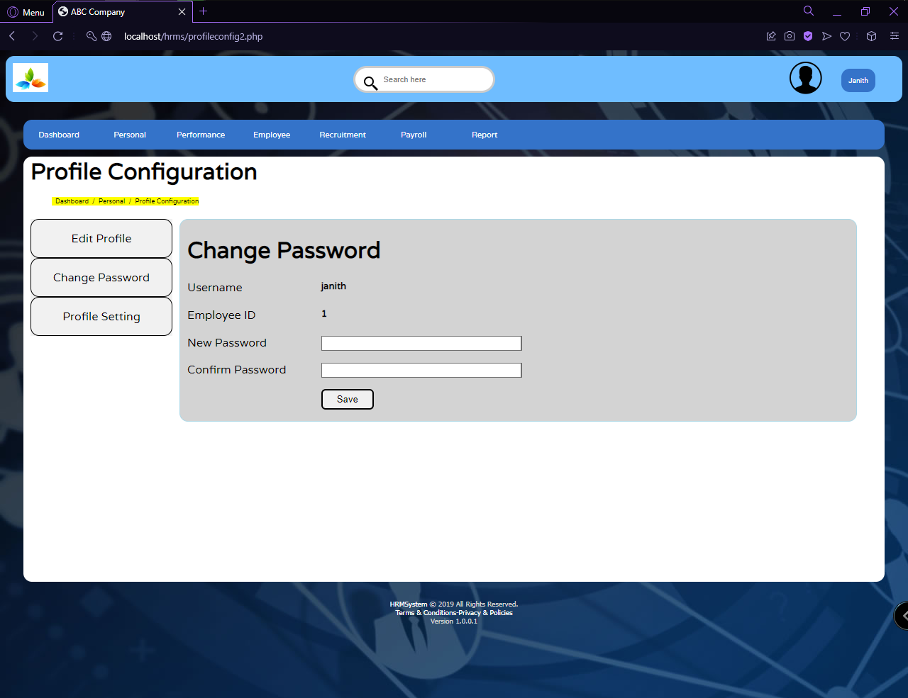

# Human Resource Management System

## 1st Year 2nd Semester - Internet & Web Technologies Project

## Technologies used: 
1. HTML
2. PHP
3. JavaScript
4. MySQL
5. XAMPP

## Contributors
1. S.A.N.L.D.Chandrasiri
2. K.P.D.T.Himaya (IT19185958)
3. I.H.A.H.Karunathilaka (IT19238722)
4. I.K.P.M.A.Shamika (IT19223490)
5. A.M.S.L.B.Bopegedara (IT19190594)

## User Interfaces

|  |  |
|--|--|
|||
|||
||  |  
